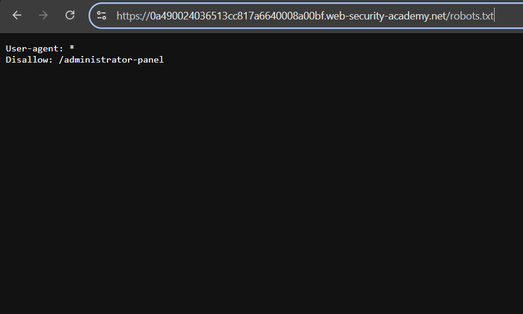
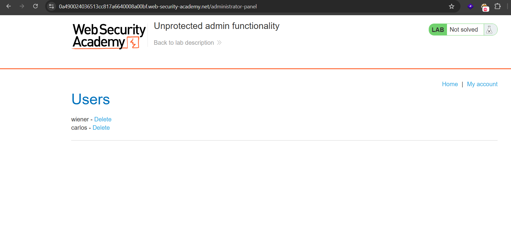
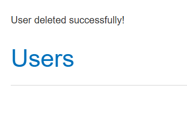
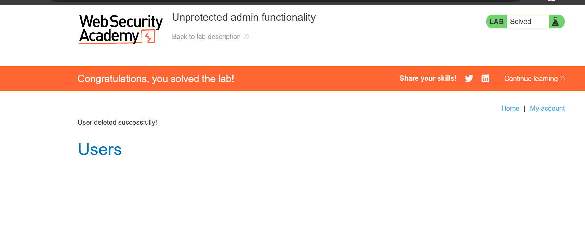

# Lab 01: Unprotected Admin Functionality

## Lab Information

| Property | Value |
|----------|-------|
| **Category** | Access Control |
| **Difficulty** | Apprentice |
| **Platform** | PortSwigger Web Security Academy |
| **Status** | ✅ Solved |

---

## Lab Description

This lab demonstrates an access control vulnerability where an administrative interface is publicly accessible without requiring authentication or authorization.

The application's `robots.txt` file unintentionally exposes the location of the administrator panel, allowing any user to access privileged functionality.

---

## Objective

Access the administrator panel and delete the user **carlos**.

---

## Vulnerability

The application exposes an administrator panel without implementing proper access control.

Additionally, the `robots.txt` file reveals the location of sensitive resources, making it easier for attackers to discover hidden administrative functionality.

---

## Testing Methodology

### Step 1 - Inspect the robots.txt File

Appended `/robots.txt` to the application URL.

```
/robots.txt
```

The response contained a **Disallow** entry revealing the administrator panel location.



---

### Step 2 - Access the Administrator Panel

Navigated directly to the disclosed endpoint.

```
/administrator-panel
```

The administrator interface loaded successfully without requiring authentication.



---

### Step 3 - Delete the User

Located the user **carlos** within the administrator panel and selected the delete option.



---

### Step 4 - Lab Solved

After deleting the user, the application confirmed the action and the lab was successfully completed.



---

## Root Cause

The administrator interface was not protected by authentication or authorization checks.

In addition, the `robots.txt` file disclosed the location of a sensitive administrative endpoint. While `robots.txt` is intended to guide search engine crawlers, it should never be relied upon to hide or secure sensitive resources.

---

## Impact

An attacker could exploit this vulnerability to:

- Access administrative functionality
- Delete or modify user accounts
- View sensitive application data
- Perform unauthorized administrative actions
- Fully compromise the application

---

## Remediation

To prevent this vulnerability:

- Restrict access to administrative endpoints using proper authentication and authorization.
- Implement role-based access control (RBAC).
- Validate user privileges on every request.
- Avoid exposing sensitive URLs in publicly accessible files such as `robots.txt`.
- Continuously audit administrative interfaces for unauthorized access.

---

## Key Takeaways

- Hidden URLs are **not** a security control.
- The `robots.txt` file should never expose sensitive application paths.
- Administrative functionality must always be protected by server-side authorization.
- Security through obscurity is not an effective defense.

---

## Skills Practiced

- Access Control Testing
- Information Disclosure
- robots.txt Enumeration
- Forced Browsing
- Authorization Testing
- Web Application Security
