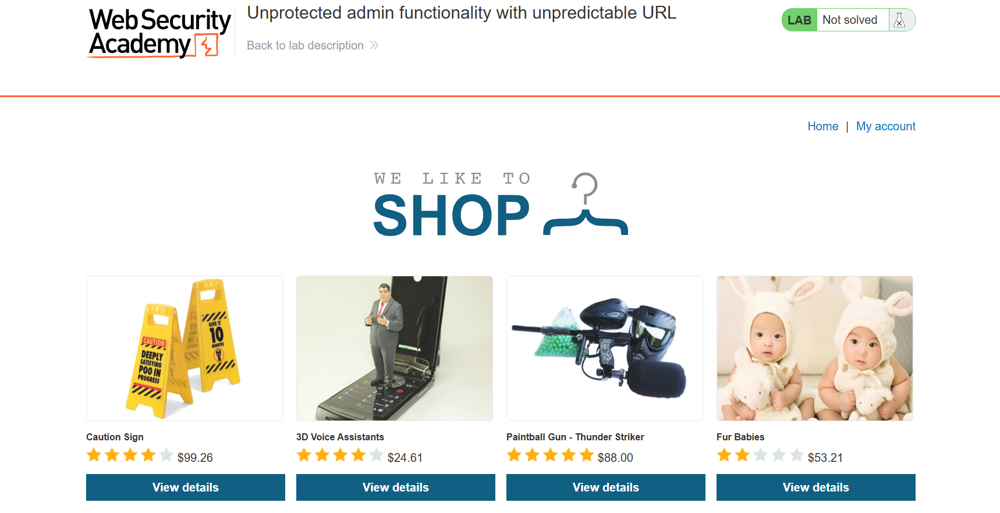
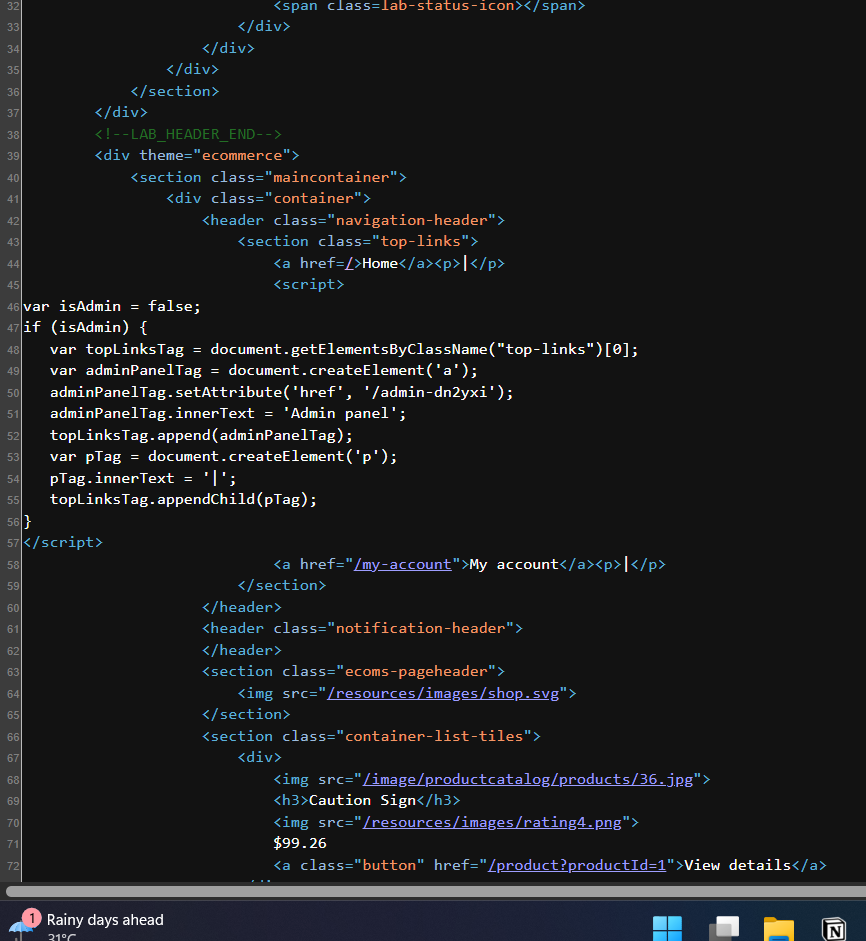
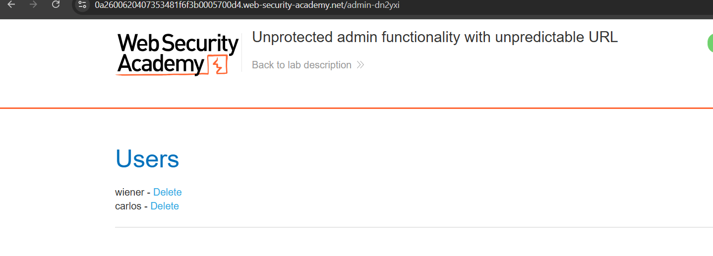
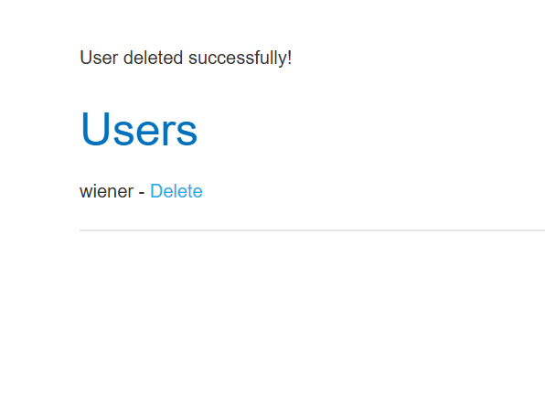
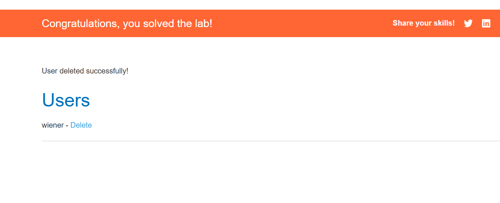

# Lab 02: Unprotected Admin Functionality with Unpredictable URL

## Lab Information

| Property | Value |
|----------|-------|
| **Category** | Access Control |
| **Difficulty** | Apprentice |
| **Platform** | PortSwigger Web Security Academy |
| **Status** | ✅ Solved |

---

## Lab Description

This lab demonstrates an access control vulnerability where the administrator panel is located at an unpredictable URL. Although the endpoint is not publicly linked, its location is unintentionally disclosed within the application's client-side JavaScript.

Because the administrator functionality lacks proper authentication and authorization checks, any user who discovers the endpoint can access privileged features.

---

## Objective

Locate the hidden administrator panel and delete the user **carlos**.

---

## Vulnerability

The application exposes sensitive administrative functionality without enforcing proper access control.

Although the administrator panel uses a non-obvious URL, the endpoint is disclosed within client-side JavaScript that is accessible to all users.

Relying on hidden URLs instead of server-side authorization is an example of **security through obscurity**, which does not provide effective protection.

---

## Testing Methodology

### Step 1 - Inspect the Homepage Source

Visited the application homepage and inspected the HTML source code using the browser's Developer Tools (or Burp Suite).

Within the source code, a JavaScript file referenced the administrator panel endpoint.



---

### Step 2 - Discover the Administrator URL

Reviewed the JavaScript file and identified the hidden administrator endpoint.

Example:

```
/admin-<random-string>
```

*(The actual endpoint varies for each lab instance.)*



---

### Step 3 - Access the Administrator Panel

Navigated directly to the disclosed administrator URL.

The administrator panel loaded successfully without requiring authentication or authorization.



---

### Step 4 - Delete the User

Located the user **carlos** within the administrator interface and selected the delete option.



---

### Step 5 - Lab Solved

After deleting the user, the application confirmed the action and the lab was successfully completed.



---

## Root Cause

The administrator interface was protected only by an unpredictable URL rather than proper authentication and authorization mechanisms.

Additionally, the supposedly hidden endpoint was exposed through publicly accessible JavaScript code, allowing attackers to discover and access privileged functionality.

---

## Impact

An attacker could exploit this vulnerability to:

- Access administrative functionality
- Delete or modify user accounts
- View confidential application data
- Perform unauthorized administrative actions
- Fully compromise the application

---

## Remediation

To prevent this vulnerability:

- Enforce server-side authentication for all administrative endpoints.
- Implement Role-Based Access Control (RBAC) to restrict privileged functionality.
- Avoid exposing sensitive endpoints in client-side JavaScript.
- Never rely on hidden or unpredictable URLs as a security mechanism.
- Perform authorization checks on every request to administrative resources.

---

## Key Takeaways

- Hidden URLs do not provide security.
- Client-side JavaScript should never contain sensitive information.
- Administrative functionality must always be protected with server-side authorization.
- Security through obscurity is not an effective defense.
- Sensitive endpoints should remain inaccessible even if their URLs become known.

---

## Skills Practiced

- Access Control Testing
- Client-Side Code Review
- JavaScript Enumeration
- Information Disclosure
- Forced Browsing
- Authorization Testing
- Web Application Security
