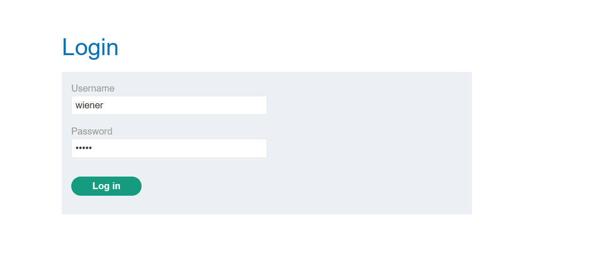
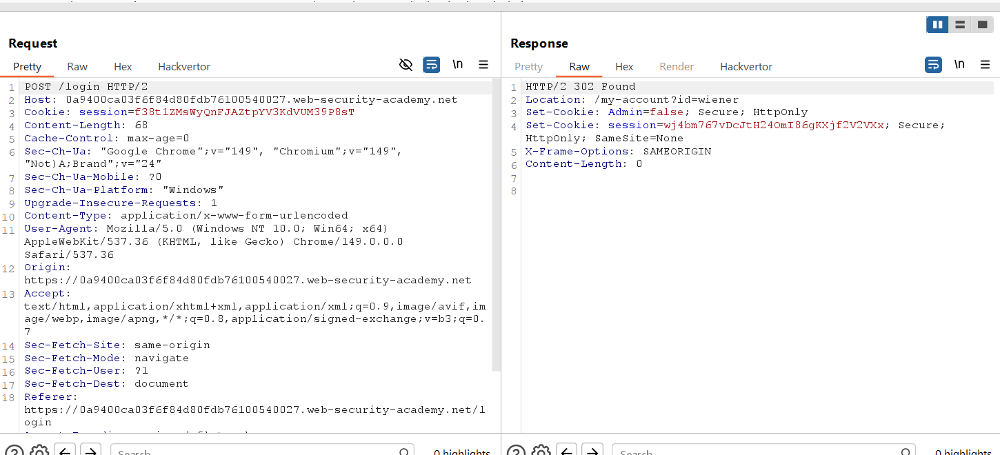
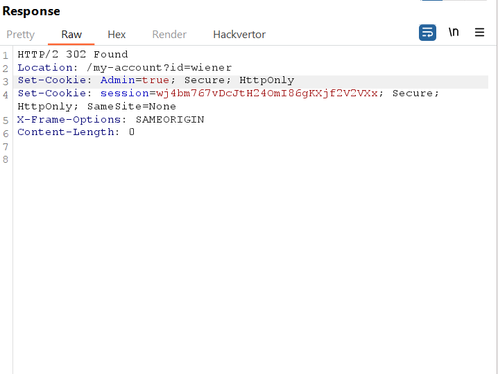
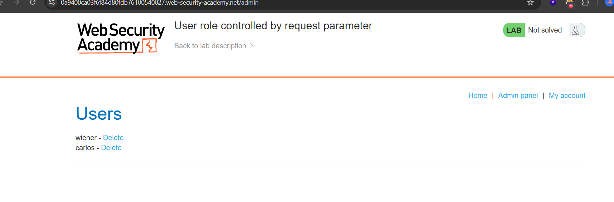
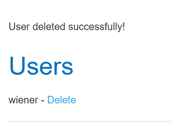
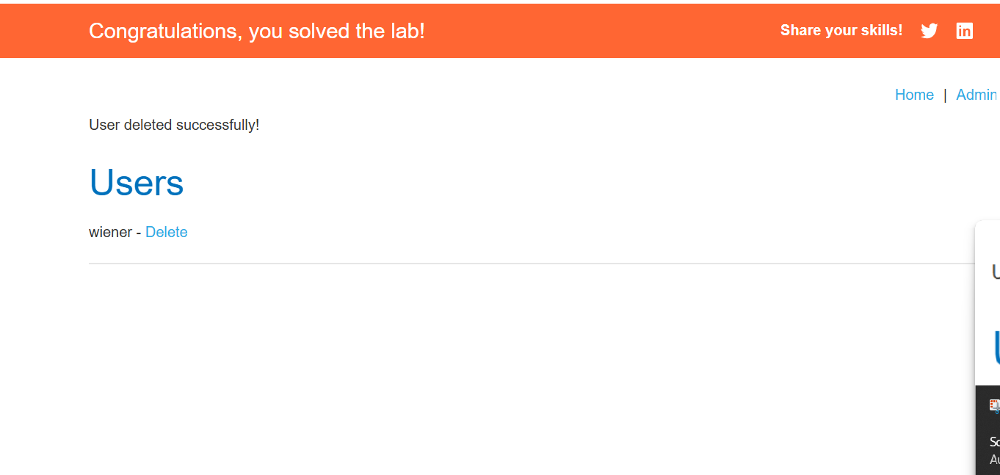

# Lab 03: User Role Controlled by Request Parameter

## Lab Information

| Property | Value |
|----------|-------|
| **Category** | Access Control |
| **Difficulty** | Apprentice |
| **Platform** | PortSwigger Web Security Academy |
| **Status** | ✅ Solved |

---

## Lab Description

This lab demonstrates an access control vulnerability where the application determines administrative privileges using a client-controlled cookie. Since the cookie can be modified by the user, an attacker can escalate privileges and gain unauthorized access to administrative functionality.

---

## Objective

Modify the application's authorization mechanism to access the administrator panel and delete the user **carlos**.

---

## Credentials

| Username | Password |
|----------|----------|
| wiener | peter |

---

## Vulnerability

The application stores the user's administrative status inside a client-controlled cookie.

```
Admin=false
```

Because the server trusts this cookie without validating it, an attacker can modify its value to gain administrator privileges.

---

## Testing Methodology

### Step 1 - Login

Logged into the application using the provided credentials.

```
Username: wiener
Password: peter
```

Enabled **Intercept Response** in Burp Suite before submitting the login request.



---

### Step 2 - Identify the Authorization Cookie

Intercepted the HTTP response after authentication.

Observed the following response header:

```
Set-Cookie: Admin=false
```

This indicated that the application stores the user's role within a client-controlled cookie.



---

### Step 3 - Modify the Cookie

Changed the cookie value from:

```
Admin=false
```

to

```
Admin=true
```

Forwarded the modified response to the browser.



---

### Step 4 - Access the Administrator Panel

Visited the administrator endpoint.

```
/admin
```

The administrator panel loaded successfully with elevated privileges.



---

### Step 5 - Delete the User

Located the user **carlos** and selected the delete option.



---

### Step 6 - Lab Solved

After deleting the user, the lab was successfully completed.



---

## Root Cause

The application relies on client-controlled data to determine authorization.

Since the `Admin` cookie is neither signed nor validated by the server, users can freely modify its value to obtain elevated privileges.

Authorization decisions should never depend on data that can be manipulated by the client.

---

## Impact

An attacker could exploit this vulnerability to:

- Escalate privileges
- Access administrator functionality
- Delete or modify user accounts
- Access sensitive administrative data
- Fully compromise the application

---

## Remediation

To mitigate this vulnerability:

- Store user roles securely on the server.
- Never trust authorization data stored in client-side cookies.
- Use signed or encrypted session tokens to prevent tampering.
- Validate user privileges on every request.
- Implement Role-Based Access Control (RBAC) using server-side session management.

---

## Key Takeaways

- Authorization decisions must always be enforced on the server.
- Client-side cookies should never determine user privileges.
- Sensitive cookies should be signed or encrypted to prevent tampering.
- Burp Suite is an effective tool for identifying insecure authorization mechanisms.

---

## Security Mapping

### OWASP Top 10 (2021)

- **A01: Broken Access Control**

### CWE

- **CWE-284:** Improper Access Control
- **CWE-565:** Reliance on Cookies Without Validation and Integrity Checking
- **CWE-602:** Client-Side Enforcement of Server-Side Security

---

## Skills Practiced

- Access Control Testing
- Cookie Manipulation
- Privilege Escalation
- Burp Suite Proxy
- HTTP Response Analysis
- Session Management Testing
- Web Application Security
