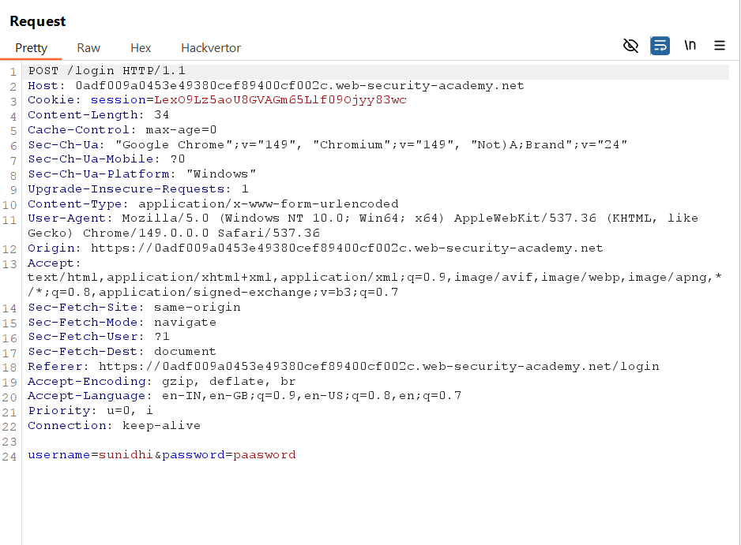
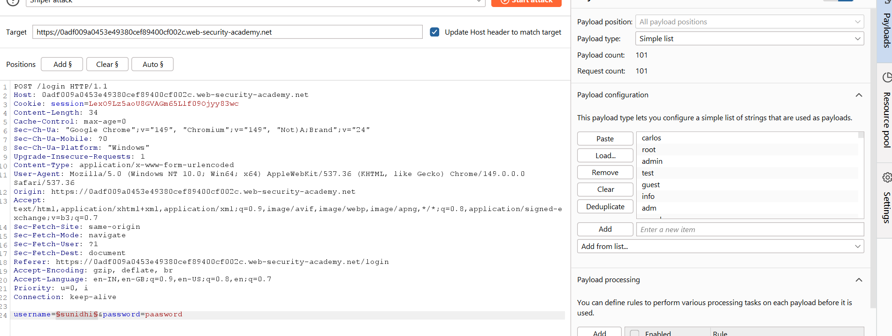
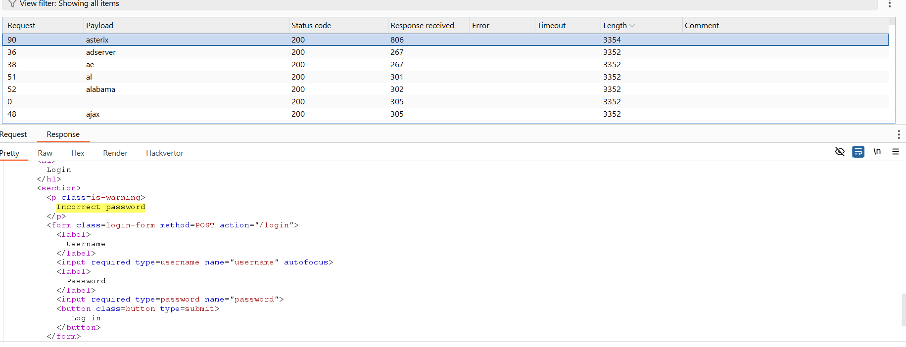
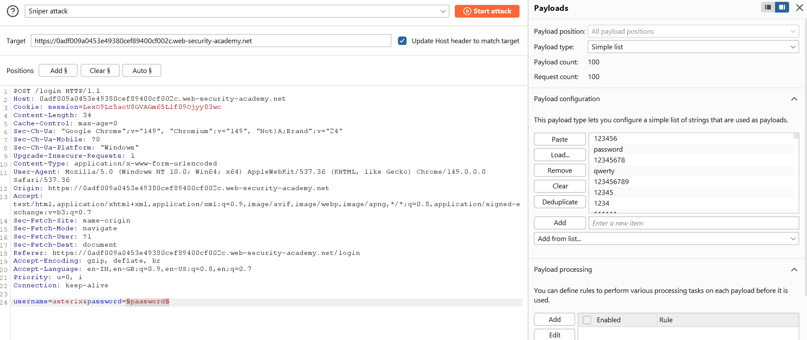
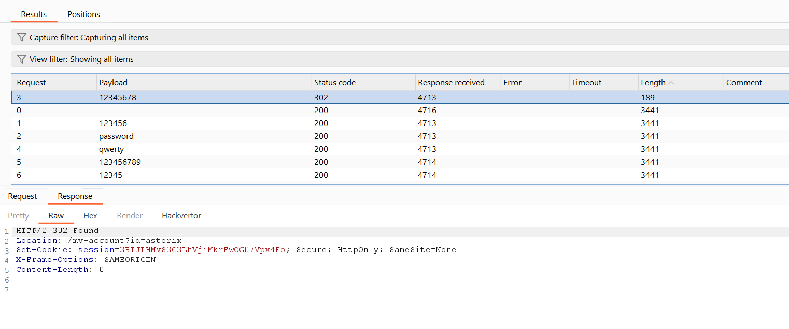
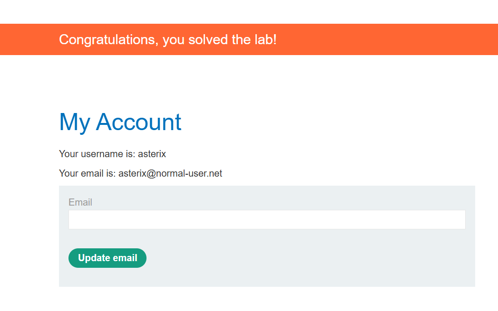

# Lab 01 - Username Enumeration via Different Responses

## Lab Information

* **Lab:** Username enumeration via different responses
* **Difficulty:** Apprentice
* **Status:** ✅ Solved

---

# Objective

Identify a valid username by analyzing differences in the application's login responses, then brute-force the corresponding password to gain access to the account.

---

# Tools Used

* Burp Suite Community Edition
* Burp Proxy
* Burp Intruder
* Web Browser

---

# Steps

## 1. Capture the Login Request

Open the login page and submit any invalid username and password.

Intercept the request using Burp Suite.

**Screenshot**



---

## 2. Enumerate the Username

Send the login request to **Burp Intruder**.

Configure the attack:

* **Attack Type:** Sniper
* Set the payload position on the `username` parameter.
* Leave the password static.

Example:

```http
username=§invalid-user§&password=test
```

Load the **Candidate Usernames** wordlist and start the attack.

**Screenshot**



---

## 3. Identify the Valid Username

Compare the responses.

Most responses contain:

```text
Invalid username
```

One response is different:

```text
Incorrect password
```

This indicates that the username exists and only the password is incorrect.

Record the valid username.

**Screenshot**



---

## 4. Brute-Force the Password

Clear the previous payload position.

Set the identified username as a fixed value and place the payload marker on the password.

Example:

```http
username=identified-user&password=§password§
```

Load the **Candidate Passwords** wordlist and start the attack.

**Screenshot**



---

## 5. Identify the Correct Password

Review the Intruder results.

Most requests return:

```text
Status: 200
```

One request returns:

```text
Status: 302
```

The **302 Redirect** indicates a successful login.

Record the password from the Payload column.

**Screenshot**



---

## 6. Log In

Use the identified username and password to log in.

Access the account page to solve the lab.

**Screenshot**



---

# Attack Summary

### Username Enumeration

* Attack Type: **Sniper**
* Payload: Candidate Usernames
* Detection Method: Different response message

### Password Brute Force

* Attack Type: **Sniper**
* Payload: Candidate Passwords
* Detection Method: HTTP **302 Redirect**

---

# Why It Works

The application returns different error messages for invalid usernames and invalid passwords.

An attacker can use these response differences to determine whether a username exists.

Once a valid username is identified, password brute-forcing becomes significantly more efficient.

---

# Impact

* Username disclosure
* Password brute-force attacks
* Account compromise
* Unauthorized access

---

# Prevention

* Return generic login error messages (e.g., "Invalid username or password").
* Implement account lockout after multiple failed attempts.
* Rate-limit login requests.
* Use CAPTCHA after repeated failures.
* Enable Multi-Factor Authentication (MFA).

---

# Key Takeaways

* Different login responses can leak valid usernames.
* Username enumeration greatly reduces brute-force effort.
* HTTP status codes and response lengths can reveal successful logins.
* Generic error messages are essential to prevent information disclosure.
