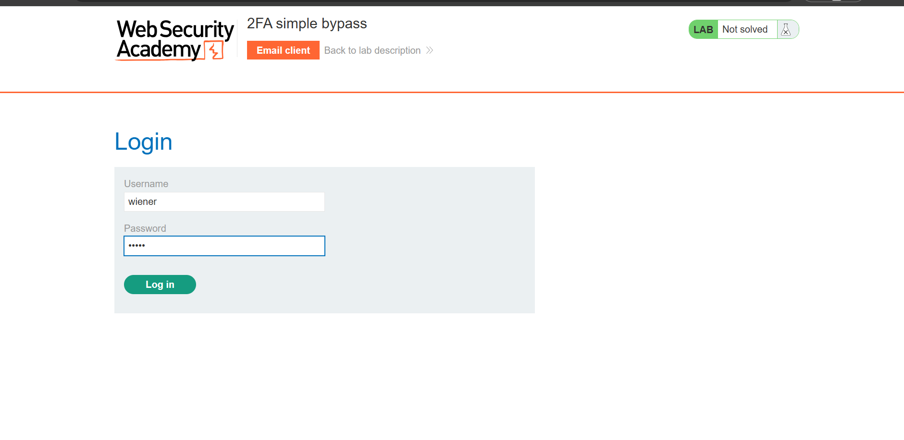
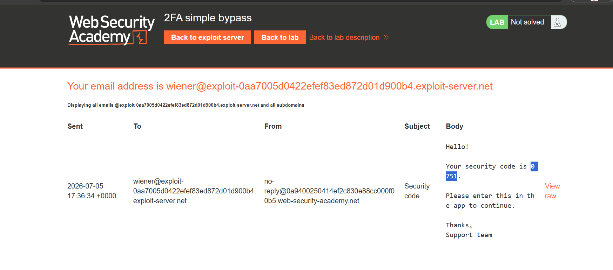
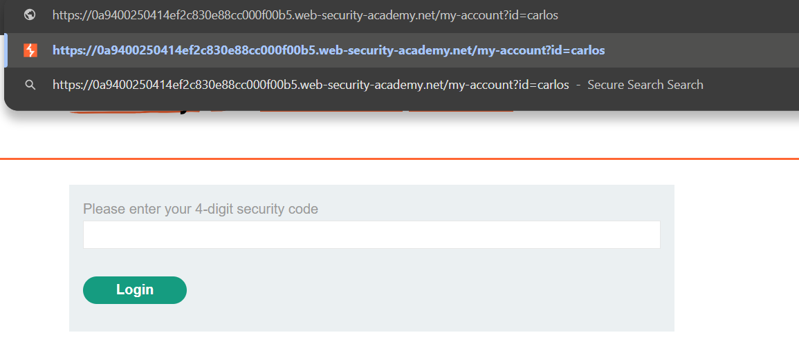
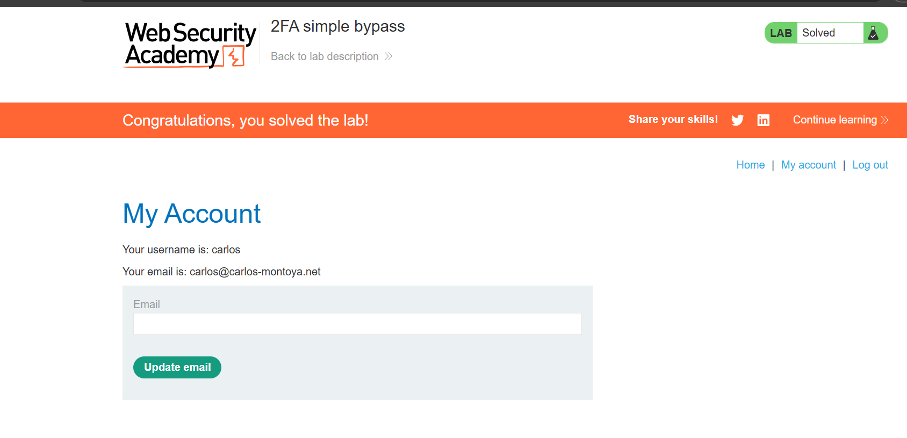

# Lab 02: 2FA Simple Bypass

## Lab Information

| Property | Value |
|----------|-------|
| **Category** | Authentication |
| **Difficulty** | Apprentice |
| **Platform** | PortSwigger Web Security Academy |
| **Status** | ✅ Solved |

---

## Lab Description

This lab demonstrates an authentication logic flaw where the application does not properly enforce two-factor authentication (2FA). Although the user is prompted for a verification code after entering valid credentials, protected resources remain accessible without completing the second authentication step.

---

## Objective

Access **Carlos's** account without providing the required two-factor authentication code.

---

## Credentials Provided

| Username | Password |
|----------|----------|
| wiener | peter |
| carlos | montoya |

---

## Vulnerability

The application validates the username and password but fails to verify whether the user has successfully completed the second authentication factor before granting access to protected resources.

Because of this improper authentication flow, an attacker can directly browse to the account page and bypass the 2FA verification process.

---

## Testing Methodology

### Step 1

Logged into the application using the provided victim credentials.

```
Username: carlos
Password: montoya
```

The application redirected to the Two-Factor Authentication page.



---

### Step 2

Instead of entering the verification code, observed that the application was waiting for 2FA validation.



---

### Step 3

Modified the browser URL manually and requested the protected endpoint.

```
/my-account
```



---

### Step 4

The application granted direct access to Carlos's account without validating the second authentication factor, successfully solving the lab.



---

## Root Cause

The application only verifies that valid credentials have been supplied. It does not verify whether the second authentication factor has been completed before allowing access to protected resources.

The authorization check relies solely on the authenticated session rather than confirming that the full authentication process has been completed.

---

## Impact

An attacker who has obtained valid credentials through phishing, credential stuffing, password reuse, or other attacks can completely bypass two-factor authentication and gain unauthorized access.

Potential impacts include:

- Account takeover
- Unauthorized access to sensitive information
- Data theft
- Privilege escalation
- Financial fraud

---

## Remediation

To mitigate this vulnerability:

- Enforce server-side validation of the 2FA completion status.
- Deny access to protected endpoints until both authentication factors have been successfully verified.
- Associate user sessions with a "2FA Completed" state.
- Perform authorization checks on every request to protected resources.
- Never rely on client-side redirects or navigation to enforce authentication.

---

## Key Takeaways

- Two-factor authentication must always be enforced on the server side.
- Authentication is only complete after every required verification step has been successfully validated.
- Protected endpoints should never be accessible before the authentication workflow has finished.
- Authentication logic flaws can be just as dangerous as technical vulnerabilities.

---

## Skills Practiced

- Authentication Testing
- Access Control Testing
- Business Logic Testing
- Manual URL Manipulation
- Web Application Security
- Burp Suite
