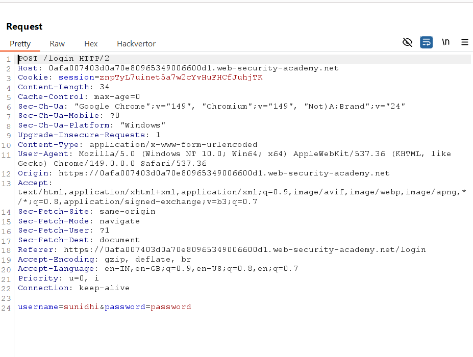
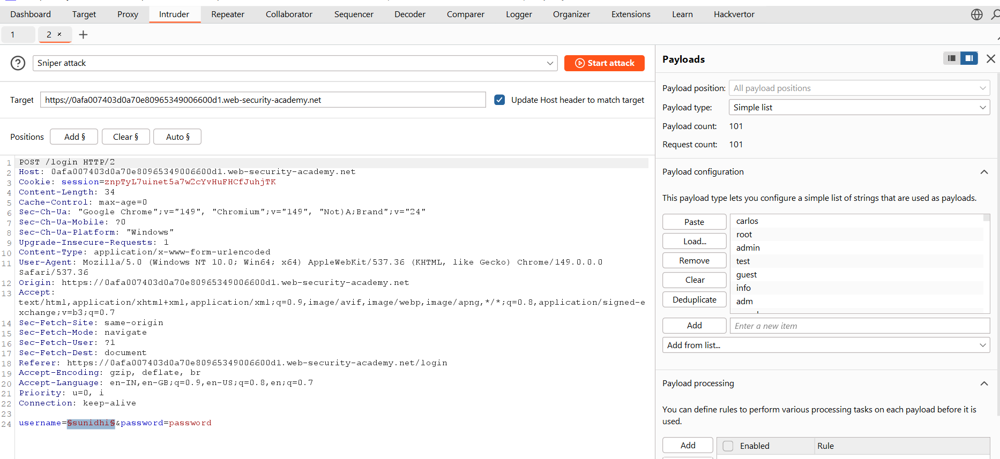
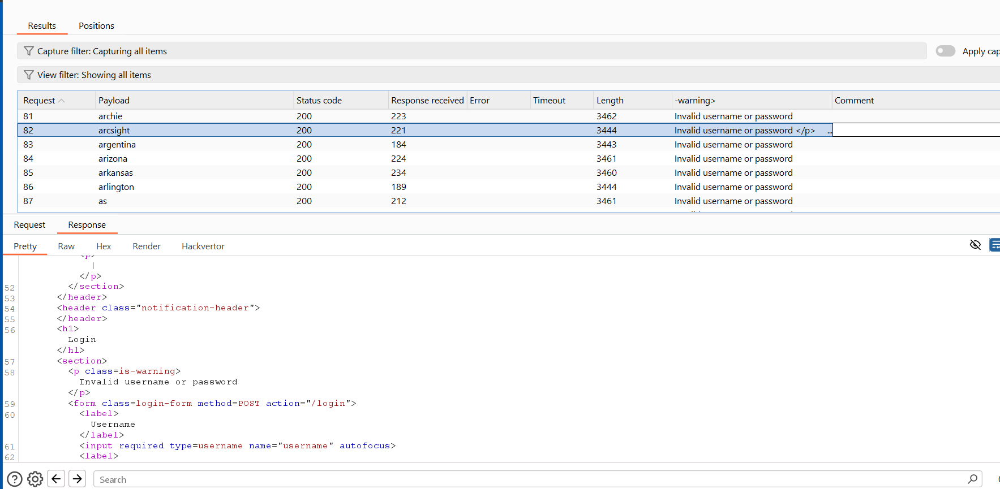
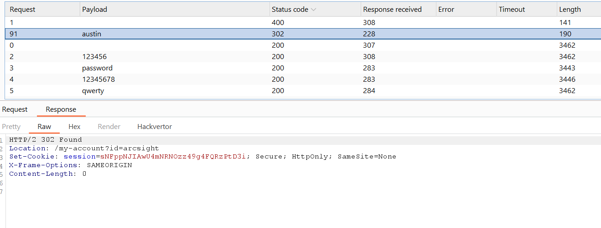
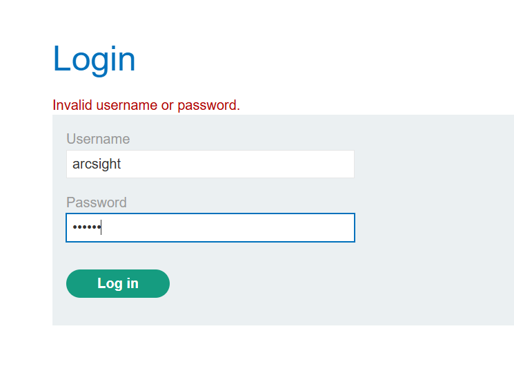
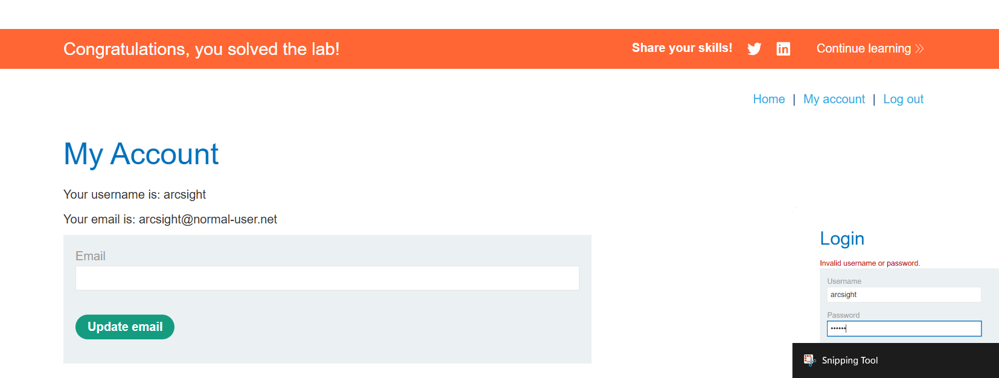

# Lab 03: Username Enumeration via Subtly Different Responses

## Lab Information

| Property | Value |
|----------|-------|
| **Category** | Authentication |
| **Difficulty** | Practitioner |
| **Platform** | PortSwigger Web Security Academy |
| **Status** | ✅ Solved |

---

## Lab Description

This lab demonstrates how subtle differences in authentication responses can allow an attacker to enumerate valid usernames. Once a valid username is identified, a password brute-force attack can be performed to gain unauthorized access.

Unlike obvious username enumeration, the application returns nearly identical error messages, making the vulnerability more difficult to detect.

---

## Objective

Identify a valid username by analyzing subtle differences in login responses, brute-force the corresponding password, and successfully access the user's account.

---

## Vulnerability

The login functionality leaks information through slightly different server responses.

Although the displayed error messages appear identical, a small difference (a trailing space instead of a period) reveals when a valid username has been supplied.

This allows attackers to enumerate usernames before launching password attacks.

---

## Testing Methodology

### Step 1 - Capture Login Request

Submitted invalid login credentials while Burp Suite was intercepting requests.

The login request was sent to **Burp Intruder** for further testing.

---

### Step 2 - Username Enumeration

Configured **Burp Intruder** using the username parameter as the payload position.

Loaded the provided candidate username wordlist and enabled **Grep - Extract** to capture the application's error message from each response.

---

### Step 3 - Identify Valid Username

After the Intruder attack completed, sorted the extracted responses.

One response contained a subtle difference in the error message (a trailing space instead of a period), indicating that the supplied username was valid.

---

### Step 4 - Password Brute Force

Using the identified username, configured Intruder again with the password parameter as the payload position.

Loaded the provided password wordlist and started the attack.

One request returned an HTTP **302 Redirect**, indicating successful authentication.

---

### Step 5 - Login

Logged into the application using the discovered username and password.

Successfully accessed the user account.

---

### Step 6 - Lab Solved

After successful authentication, the lab was marked as solved.

---

## Root Cause

The application generates different responses depending on whether the supplied username exists.

Although the variation is extremely subtle, it is still sufficient for attackers to distinguish valid usernames.

After enumeration, the application does not implement adequate protections against password brute-force attacks.

---

## Impact

An attacker can:

- Enumerate valid usernames
- Perform targeted password brute-force attacks
- Gain unauthorized account access
- Compromise user accounts
- Increase the effectiveness of credential stuffing attacks

---

## Remediation

To prevent username enumeration attacks:

- Return identical responses for both invalid usernames and incorrect passwords.
- Ensure response length, wording, status codes, and timing remain consistent.
- Implement account lockout or progressive delays after repeated failed logins.
- Apply rate limiting to authentication endpoints.
- Enable Multi-Factor Authentication (MFA).
- Monitor authentication logs for brute-force attempts.

---

## Key Takeaways

- Small differences in authentication responses can leak sensitive information.
- Username enumeration significantly increases the success rate of brute-force attacks.
- Burp Suite Intruder can efficiently automate enumeration attacks.
- Authentication responses should be consistent regardless of whether a username exists.
- Authentication testing involves examining not only visible messages but also response length, status codes, headers, and timing.

---

## Skills Practiced

- Authentication Testing
- Username Enumeration
- Password Brute Forcing
- Burp Suite Intruder
- Grep - Extract
- Response Analysis
- Web Application Security
