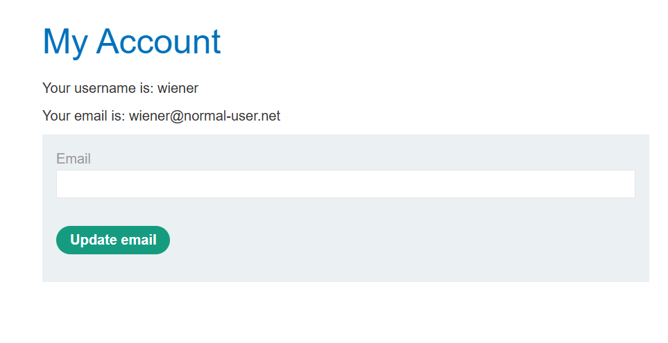
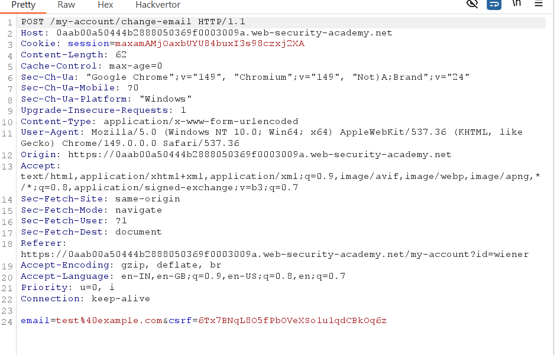
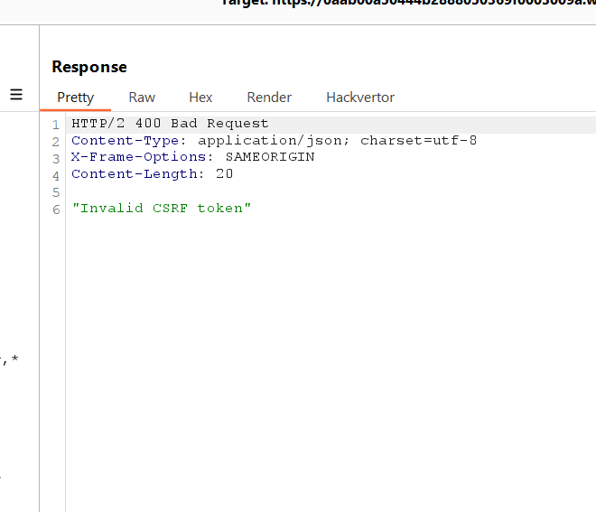
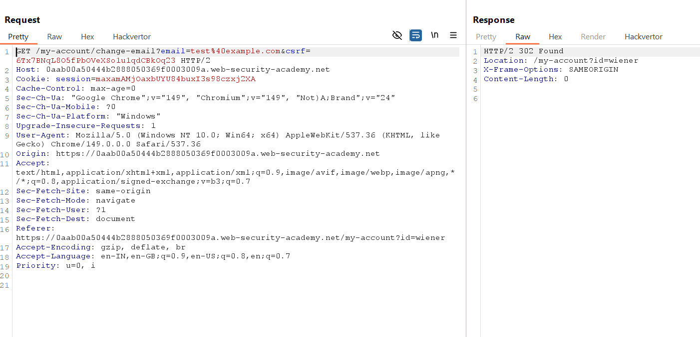
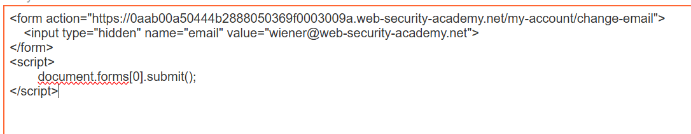
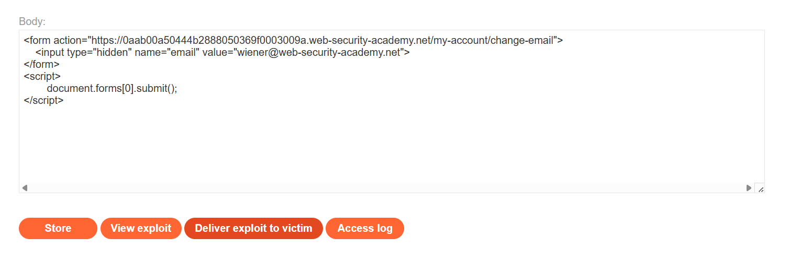

# Lab 02 - CSRF Where Token Validation Depends on Request Method

## Lab Information

* **Lab:** CSRF where token validation depends on request method
* **Difficulty:** Practitioner
* **Status:** ✅ Solved

---

# Objective

Exploit a CSRF vulnerability by changing the request method from **POST** to **GET**, bypassing the application's CSRF token validation and changing the victim's email address.

---

# Tools Used

* Burp Suite Community Edition
* Burp Proxy
* Burp Repeater
* Exploit Server
* Web Browser

---

# Steps

## 1. Log in to the Application

Log in using the provided credentials:

```text
Username: wiener
Password: peter
```

Navigate to **My Account**.

**Screenshot**



---

## 2. Capture the Email Change Request

Change the email address and intercept the request using Burp Suite.

The original request is sent using the **POST** method and contains a CSRF token.

**Screenshot**



---

## 3. Test CSRF Token Validation

Send the request to **Burp Repeater**.

Modify the value of the `csrf` parameter and send the request.

The server rejects the request, confirming that the CSRF token is validated for **POST** requests.

**Screenshot**



---

## 4. Change the Request Method

In Burp Repeater, right-click the request and select:

```
Change request method
```

This converts the request from **POST** to **GET**.

Notice that the application no longer validates the CSRF token.

**Screenshot**



---

## 5. Create the CSRF Exploit

Create the following HTML and paste it into the Exploit Server.

```html
<form action="https://YOUR-LAB-ID.web-security-academy.net/my-account/change-email">
    <input type="hidden" name="email" value="attacker@example.com">
</form>

<script>
document.forms[0].submit();
</script>
```

Replace the lab URL with your own lab instance.

**Screenshot**



---

## 6. Deliver the Exploit

Click **Store** and then **Deliver to victim**.

The victim's browser submits the forged **GET** request, successfully changing the email address and solving the lab.

**Screenshot**



---

# Payload Used

```html
<form action="https://YOUR-LAB-ID.web-security-academy.net/my-account/change-email">
    <input type="hidden" name="email" value="attacker@example.com">
</form>

<script>
document.forms[0].submit();
</script>
```

---

# Why It Works

The application validates the CSRF token only for **POST** requests.

After changing the request to **GET**, the server processes the request without verifying the CSRF token. Since the victim's browser automatically includes the session cookie, the forged request is accepted and the victim's email address is changed.

---

# Impact

* Unauthorized account modifications
* Email address takeover
* Account recovery abuse
* Account compromise

---

# Prevention

* Enforce CSRF validation on **all** HTTP methods that modify data.
* Reject state-changing operations over **GET** requests.
* Use anti-CSRF tokens consistently.
* Validate the `Origin` and `Referer` headers.
* Set session cookies with the `SameSite` attribute.

---

# Key Takeaways

* State-changing actions should never be performed using **GET** requests.
* CSRF protection must be enforced consistently across all request methods.
* Browsers automatically include session cookies with cross-site requests.
* A missing or inconsistent CSRF validation can completely bypass the application's protection.
