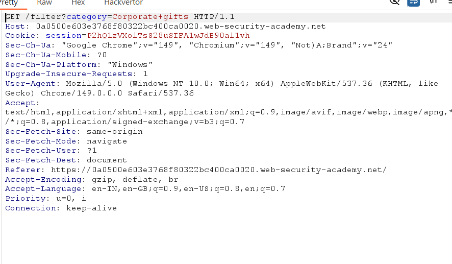
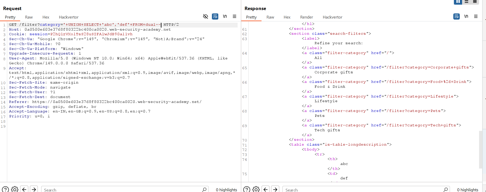
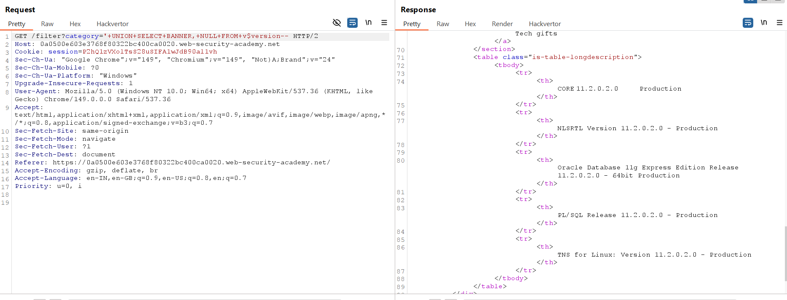

# Lab 03 - SQL Injection Attack: Querying the Database Type and Version (Oracle)

## Lab Information

* **Lab:** SQL injection attack, querying the database type and version on Oracle
* **Difficulty:** Practitioner
* **Status:** ✅ Solved

---

# Objective

Exploit a SQL Injection vulnerability in the product category filter using a UNION attack to retrieve the Oracle database version.

---

# Tools Used

* Burp Suite Community Edition
* Burp Proxy
* Burp Repeater
* Web Browser

---

# Steps

## 1. Open the Lab

Launch the lab and browse to any product category.

**Screenshot**


---

## 2. Capture the Request

Intercept the request containing the `category` parameter using Burp Suite.

**Screenshot**



---

## 3. Determine the Number of Columns

Use a UNION SELECT payload to determine the number of columns returned by the query.

Payload:

```sql
'+UNION+SELECT+'abc','def'+FROM+dual--
```

The application returns both values successfully, confirming:

* Two columns are returned.
* Both columns accept text values.

**Screenshot**



---

## 4. Retrieve the Oracle Database Version

Replace the previous payload with the following:

```sql
'+UNION+SELECT+BANNER,+NULL+FROM+v$version--
```

The application displays the Oracle database version string on the page.

**Screenshot**



---

# Payloads Used

### Verify Column Count

```sql
'+UNION+SELECT+'abc','def'+FROM+dual--
```

### Retrieve Database Version

```sql
'+UNION+SELECT+BANNER,+NULL+FROM+v$version--
```

---

# Why It Works

The application is vulnerable to SQL Injection in the `category` parameter.

Using a UNION-based SQL Injection allows the attacker to append a second query to the original SQL statement.

Since Oracle requires selecting from a table, the payload uses the built-in `dual` table for testing.

After identifying that two text columns are returned, the query retrieves the `BANNER` column from the `v$version` system view, which contains the Oracle version information.

---

# Impact

* Database fingerprinting
* Disclosure of database version
* Assists attackers in identifying database-specific exploits
* Useful during reconnaissance for further SQL Injection attacks

---

# Prevention

* Use parameterized queries (prepared statements)
* Validate and sanitize user input
* Restrict access to system tables and views
* Apply the principle of least privilege
* Return generic error messages instead of database information

---

# Key Takeaways

* UNION attacks require matching the original query's column count.
* Oracle requires the `dual` table when selecting constant values.
* The `v$version` view exposes Oracle version details.
* Database fingerprinting is often the first step in exploiting SQL Injection vulnerabilities.
